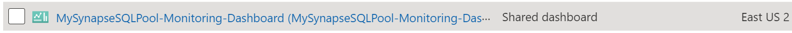

# AzureMonitor-Samples

Generalized sample for an Azure Synapse Analytics shared Azure Dashboard deployable via Azure Resource Manager (ARM). Intended to be part of an Azure DevOps pipeline during provisioning of a new Azure Synapse Analytics instance and related resources.

## Problem Statement

[Azure Dashboards](https://docs.microsoft.com/en-us/azure/azure-portal/azure-portal-dashboards) may be created for private consumption or shared more broadly with a larger team. Typically an Azure Dashboard is built in the Azure Portal for a specific purpose. Unfortunately if an 'eyes on glass' or other 'at a glance' standardized dashboard is needed for a large number resources, creating and maintaining them manually is not easily done via the Azure Portal.

Fortunately, Azure Dashboards provides a means of programmatic provisioning which allows operations teams to stamp out and version Azure Dashboards as ARM templates. These dashboard templates may be stored in source control and included into CI/CD pipelines.

This example demonstrates a generalized ARM template containing an Azure Synapse Analytics dashboard that may be repeatedly deployed into one or more resource groups with externalized inputs specific to a given Synapse Analytics Deployment. The dashboard is based on a Microsoft CSS blog series linked below. The dashboard data is sourced from Azure Multidimensional Metrics (MDM) as well as Azure Monitor Logs (Log Analytics). Once deployed the dashboard will resemble the following assuming the Azure Synapse Analytics resource has diagnostics configured to be sent to a Log Analytics workspace.


Once deployed the Azure Dashboard may be secured by Azure RBAC. In the Azure Portal the shared dashboard resource  will be 'hidden' by default in the Azure Portal but is visable via selecting 'show hidden' or via your Azure CLI of choice. The resource provider is [Microsoft.Portal/dashboards](https://docs.microsoft.com/en-us/azure/templates/microsoft.portal/dashboards).



## Deployment Example (local)

```PowerShell
.\deploy.ps1 -ResourceGroupName SQLCollectorSampleRG -TemplateFilePath .\azuredeploy.json -TemplateParameterFilePath .\azuredeploy.parameters.json
```

Please note that the scope for Log Analytics workspace needs to contain the underlying Log Analytics workspace that contains the diagnostics for the dedicated SQLPool (Synapse Analytics). In the sample this is computer via a ARM stirng concatenation. If necessary adjust this scope to the environment of your deployment.

```Javascript
[concat('/subscriptions/',parameters('subscriptionId'),'/resourceGroups/',parameters('resourceGroupName'),'/providers/Microsoft.Sql/servers/',parameters('sqlpoolservername'),'/databases/',parameters('synapseDatabaseName'))]
```

## References & Attribution
- [Azure metrics Dashboard for Azure Synapse Analytics - Part 1](https://techcommunity.microsoft.com/t5/azure-synapse-analytics/azure-metrics-dashboard-for-azure-synapse-analytics-part-1/ba-p/2016393)
- [Azure metrics Dashboard (Custom dashboards using Log Analytics) for Azure Synapse Analytics - Part 2](https://techcommunity.microsoft.com/t5/azure-synapse-analytics/azure-metrics-dashboard-custom-dashboards-using-log-analytics/ba-p/2016426)
- [askpra/AzureSynapseAnalytics_LogAnalyticsScripts](https://github.com/askpra/AzureSynapseAnalytics_LogAnalyticsScripts)
- [Programmatically create Azure Dashboards](https://docs.microsoft.com/en-us/azure/azure-portal/azure-portal-dashboards-create-programmatically#create-a-template-from-the-json)
- [Shared Dashboard Example - Azure Quickstart Sample](https://github.com/Azure/azure-quickstart-templates/tree/master/101-default-shared-dashboard)
